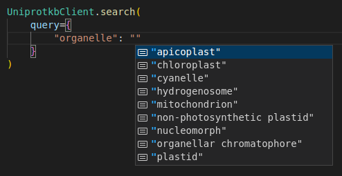

# Unipressed

## Introduction

Unipressed (Uniprot REST) is an API client for the protein database [Uniprot](https://www.uniprot.org/).
It provides thoroughly typed and documented code to ensure your use of the library is easy, fast, and correct!

### Example
Let's say we're interested in very long proteins that are encoded within a chloroplast, in any organism:
```python
import json
from unipressed import UniprotkbSearch

for record in UniprotkbSearch(
    query={
        "and_": [
            {"organelle": "chloroplast"},
            {"length": (5000, "*")}
        ]
    },
    fields=["length", "gene_names"]
).each_record():
    print(json.dumps(record, indent=4))
```

This will print:
```json
{
    "primaryAccession": "A0A088CK67",
    "genes": [
        {
            "geneName": {
                "evidences": [
                    {
                        "evidenceCode": "ECO:0000313",
                        "source": "EMBL",
                        "id": "AID67672.1"
                    }
                ],
                "value": "ftsH"
            }
        }
    ],
    "sequence": {
        "length": 5242
    }
}
```

### Advantages

* Detailed type hints for autocompleting queries as you type  
* Autocompletion for return fields 
* Documentation for each field:

    <figure markdown>
    {width="300"}
    </figure>

* Automatic results parsing, for `json`, `tsv`, `list`, and `xml`
* Built-in pagination, so you don't have to handle any of that yourself!
* Most of the API is automatically generated, ensuring very rapid updates whenever the API changes
* Thoroughly tested, with 41 unit tests and counting!

## Usage

### Query Syntax

You can't go wrong by following the type hints.
I strongly recommend using something like [`pylance`](https://marketplace.visualstudio.com/items?itemName=ms-python.vscode-pylance) for [Visual Studio Code](https://code.visualstudio.com/), which will provide automatic completions and warn you when you have used the wrong syntax.

If you already know how to use the Uniprot query language, you can always just input your queries as strings:
```python
UniprotkbSearch(query="(gene:BRCA*) AND (organism_id:10090)")
```

However, if you want some built-in query validation and code completion using Python's type system, then you can instead use a dictionary.
The simplest query is a dictionary with a single key: 
```python
{
    "family": "kinase"
}
```

You can compile more complex queries using the `and_`, `or_` and `not_` keys.
These first two operators take a list of query dictionaries: 
```python
{
    "and_": [
        {"family": "kinase"},
        {"organism_id": "9606"},
    ]
}
```

Most "leaf" nodes of the query tree are strings. 
A few are integers or floats, and a few are *ranges*, which you input using a tuple with two elements, indicating the start and end of the range.
If you use the literal "*" then you can leave the range open at one end. 
For example, this query returns and protein that is in the range $(5000, \infty)$
```python
{"length": (5000, "*")}
```